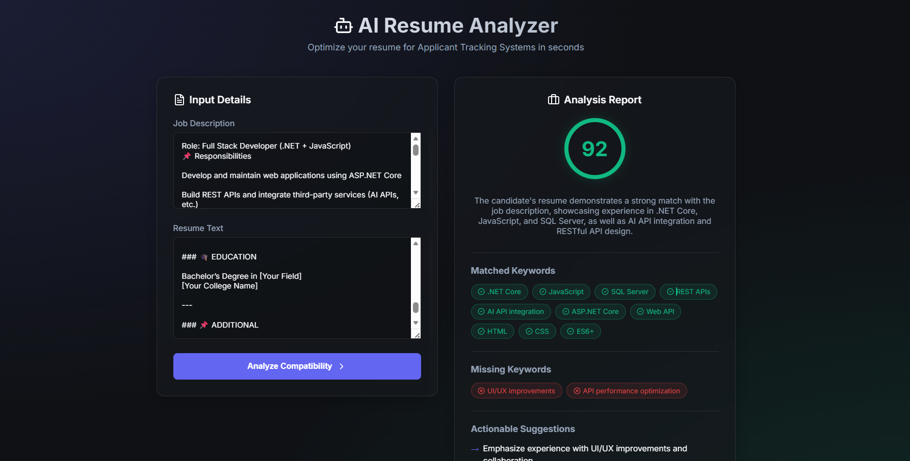
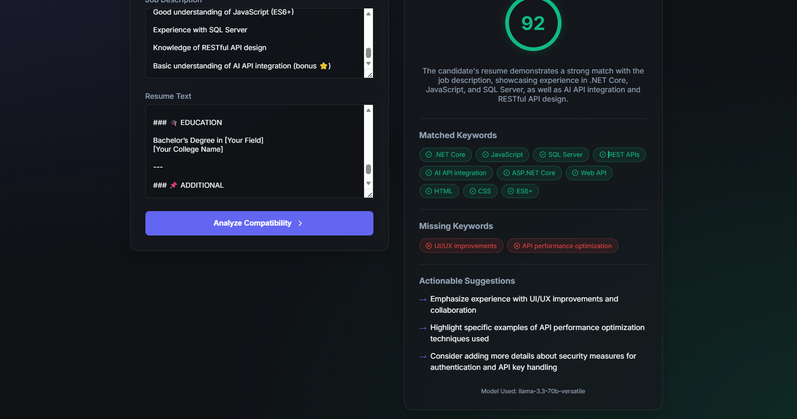

# AI Resume Analyzer (ATS Optimizer)

🚀 **Optimize your resume for Applicant Tracking Systems in seconds.**

AI Resume Analyzer is a powerful tool designed to bridge the gap between job seekers and recruitment software. By leveraging the **Groq Llama-3** model, it provides deep analysis of how well your resume matches a specific job description, highlighting missing keywords and offering actionable suggestions for improvement.

---

## ✨ Features

- **Multi-Format Support**: Upload resumes in `.pdf`, `.docx`, `.doc`, or `.txt` formats.
- **OCR Integration**: Built-in support for image-heavy resumes using Tesseract.js.
- **Deep Analysis**: Powered by Groq AI to provide:
  - **ATS Compatibility Score**: A visual score from 0 to 100.
  - **Keyword Matching**: Identify which critical skills you have and which are missing.
  - **Suggestions**: Professional advice on how to tailor your content for recruiters.
- **Premium UI**: Modern dark-mode interface with glassmorphism and smooth animations.

---

## 🖼️ UI Demonstration


### Landing View \ Empty Analyzer State


### Full Analyzer View & Analysis Report





---

## 🛠️ Tech Stack

### Frontend
- **React 19** + **Vite**
- **Vanilla CSS** (Custom Glassmorphism Design)
- **Lucide-React** for iconography
- **Mammoth.js** (DOCX parsing) & **PDF.js** (PDF parsing)
- **Tesseract.js** (OCR support)

### Backend
- **.NET 10** Web API
- **Groq SDK** (Custom implementation for High-Performance AI inference)
- **Llama 3.3 70B Versatile** (Default LLM)

---

## 🚀 Getting Started

Follow these instructions to set up the project locally.

### Prerequisites
- [.NET 10 SDK](https://dotnet.microsoft.com/download)
- [Node.js](https://nodejs.org/) (v18 or higher)
- [Groq API Key](https://console.groq.com/keys)

### 1. Backend Setup
1. Navigate to the `backend` directory:
   ```bash
   cd backend
   ```
2. Open `appsettings.json` and add your Groq API key:
   ```json
   "Groq": {
     "ApiKey": "YOUR_GROQ_API_KEY",
     "BaseUrl": "https://api.groq.com/openai/v1",
     "Model": "llama-3.3-70b-versatile",
     "MaxTokens": 4096,
    "Temperature": 0.3,
    "TimeoutSeconds": 60
   }
   ```
3. Run the backend:
   ```bash
   dotnet run
   ```
   The API will typically be available at `https://localhost:7150`.

### 2. Frontend Setup
1. Navigate to the `frontend` directory:
   ```bash
   cd frontend
   ```
2. Install dependencies:
   ```bash
   npm install
   ```
3. Configure the environment:
   Create a `.env` file in the `frontend` directory (if not already present) and ensure it points to your backend URL:
   ```env
   VITE_API_BASE_URL=https://localhost:7150/api
   ```
4. Start the development server:
   ```bash
   npm run dev
   ```
5. Open your browser to the URL provided by Vite (usually `http://localhost:5173`).

---

## 📝 Usage
1. Paste the **Job Description** in the first text area.
2. Upload your **Resume** or paste the text directly.
3. Click **Analyze Compatibility**.
4. Review the generated report to improve your resume!

---

## 🔒 Security
- **API Keys**: Never commit your `appsettings.json` or `.env` files with real keys to public repositories. Use `.gitignore` to protect them.
- **Privacy**: No resume data is stored; it is only processed in-memory for analysis.

---

Built to help job seekers create stronger, ATS-friendly resumes.
